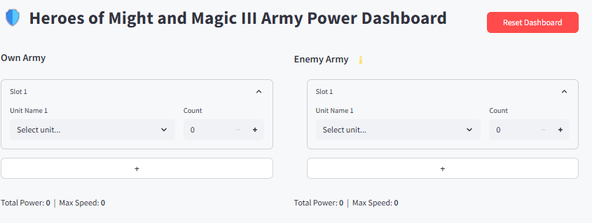
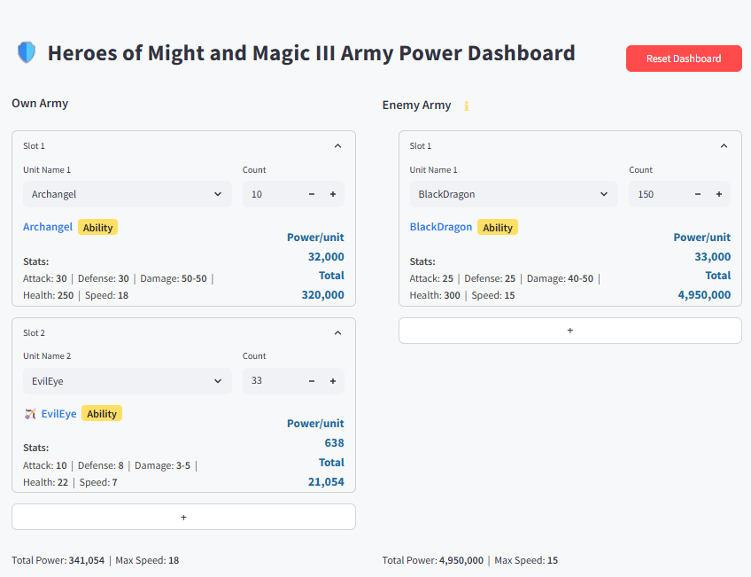

# HOMM3 Army Power Dashboard

> In the beginning, there was only chaos and the Dashboard-a shimmering portal of numbers, squatting at the center of your screen, gazing back with the same blank, expectant stare as a peasant conscript facing a Black Dragon. Welcome, traveler, to the Army Power Dashboard: a Streamlit app where the arithmetic of war becomes a cosmic ballet of stats, spreadsheets, and existential dread.

---

## Table of Contents

- [What Is This?](#what-is-this)
- [Features](#features)
- [Installation](#installation)
- [Usage](#usage)
- [Screenshots](#screenshots)
- [Contributing](#contributing)
- [License](#license)
- [Future Directions](#future-directions)
- [Epilogue](#epilogue)

---

## What Is This?

Behold: a dashboard that splits the world in twain-on the left, your own battered legions; on the right, the enemy, their faces as familiar and yet as unknowable as your own reflection in a puddle after a rainstorm laced with sulfur and regret.

This tool is for those who do not remember every creature's stats, for the tactician who wants to import their own army data and the data of an enemy-be it another hero or a wandering horde of free creatures-to decide if an attack is wise or merely an elaborate form of self-sabotage.

Each army is a procession of seven empty slots, yearning to be filled. Here, you will inscribe the names of units: Pikeman, Angel, Peasant-names that echo through the halls of memory like the footsteps of a tax collector in an abandoned village. You will enter their numbers, as if counting the grains of sand in an hourglass that measures not time, but the slow erosion of hope.

And then, the Power Score:  
$$
\text{Power Score} = (\text{Attack} + \text{Defence} + \text{Speed} + \frac{\text{Min Damage} + \text{Max Damage}}{2}) \times \text{Health}
$$
A formula so simple, so profound, it mocks the futility of all human endeavor.

---

## Features

- **Dual Army Display:** Two columns-like the twin pillars of Solomon’s temple, or the legs of a table that wobbles on the uneven floor of fate.
- **Seven Slots per Army:** Because six is too few and eight is hubris.
- **Unit Input:** Name your units, count your units, realize too late that you have chosen poorly.
- **Import Army Data:** Load your army and the enemy’s army (another hero or wandering creatures) to assess your odds.
- **Real-Time Power Calculation:** Watch as your hopes are quantified and found wanting.
- **Unit Stat Display:** Each stat a tiny window into the soul of a creature doomed to die for your glory.
- **Army Totals:** At the bottom, the sum of all fears: total power and maximum speed, staring up at you like the eyes of a hungry dog.
- **Error Handling:** Enter a unit name incorrectly and the dashboard will rebuke you, gently, like a disappointed parent.

---

## Installation

1. **Clone this repository**  
   `git clone https://github.com/alibekk93/HOMM3_army_dashboard.git`

2. **Install dependencies**  
   `pip install streamlit pandas`

3. **Check the sacred CSV**  
   Ensure that `H3Units_Enhanced.csv` is present in the main directory of the project.  
   (This file is the Book of Names-without it, the dashboard is a hollow shell, a golem without a soul. For reasons known only to Streamlit, it cannot be nested in a subfolder.)

---

## Usage

1. **Run the app**  
   `streamlit run dashboard.py`

2. **Behold the dashboard**  
   A page will open. Two armies glare at each other across the digital void.  
   Import your army data and the enemy’s (another hero or free creatures).  
   Enter unit names and numbers.  
   Watch as the Power Score blooms and withers before your eyes.

3. **Interpret the results**  
   Are you stronger? Faster? Or merely more numerous, like locusts before the harvest?

---

## Screenshots

### Blank Dashboard:

The dashboard in its purest form-two empty columns, seven vacant slots per side, a battlefield awaiting the arrival of armies. The silence before the storm, where possibility and uncertainty reign.

### Example of a filled dashboard

On the left, your army fields two units-perhaps a hopeful mix of steel and feathers. On the right, the enemy stands alone, but radiates overwhelming power. The numbers tell the tale: sometimes, one is enough to inspire dread. This screenshot captures the moment when caution and curiosity collide, and the Power Score delivers its verdict.

---

## Contributing

To contribute is to embrace futility, and yet, what is life but a series of futile gestures performed with increasing desperation? Fork, branch, submit a pull request.  
Correct a typo, add a feature, or simply scream into the void.  
All are welcome. None will be remembered.

---

## License

MIT.  
A license as permissive as the wind, as indifferent as the grave.

---

## Future Directions

- **Creature Images:** Soon, each unit will be accompanied by its portrait-so you can gaze into the eyes of your doom in glorious pixelated color.
- **Hero Skills and Stats:** The dashboard will grow wise, tracking not just armies but the skills and stats of their commanders, letting you factor in the cunning (or incompetence) of your heroes.
- **More Features:** Suggestions, dreams, and fevered visions welcome.